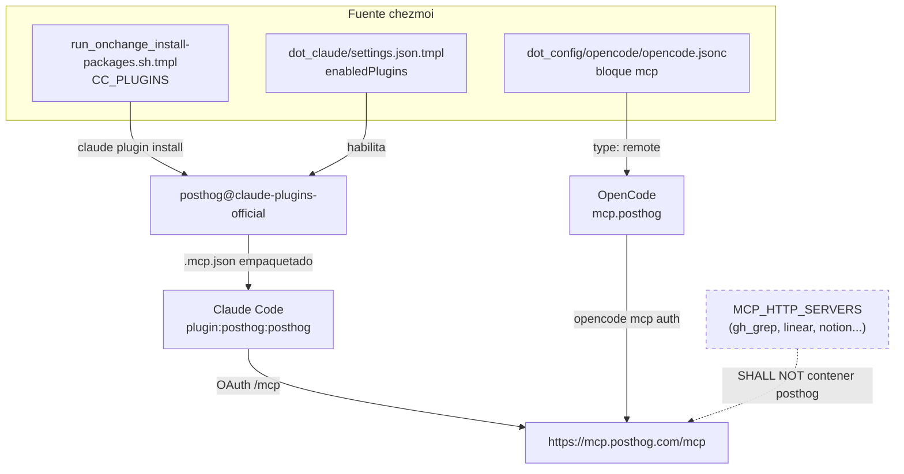

# Requirements

### Overview & Goals

Crear el change de OpenSpec **`add-posthog-mcp`** (ticket **DOT-53**) con la cadena completa de artefactos del schema `spec-driven` (`proposal` → `specs` → `design` → `tasks`), que documente cómo incorporar el MCP de PostHog (`https://mcp.posthog.com/mcp`) al entorno gestionado por chezmoi.

> **El entregable es exclusivamente documentación de OpenSpec.** Este trabajo **no implementa nada**: el único directorio que se escribe es `openspec/changes/add-posthog-mcp/`. Ninguna plantilla de chezmoi, ni el README, ni el manual se modifican; la implementación real es un trabajo posterior guiado por el `tasks.md` que aquí se redacta.

Objetivos:

- Dejar **escrito y validado** cómo debe quedar el acceso a PostHog (analytics, feature flags, experimentos, error tracking, HogQL) desde Claude Code y OpenCode tras `chezmoi apply`.
- Documentar la solución **sin duplicar** el set de herramientas de PostHog ni obligar a dos flujos OAuth en el mismo cliente.
- Dejar el reparto de capacidades y la decisión de "plugin sí / `MCP_HTTP_SERVERS` no" escrita en spec, para que un cambio futuro no vuelva a añadir el servidor por la vía del install script.

### Scope

**In Scope**

- Scaffolding del change `add-posthog-mcp` con `openspec new change` (schema por defecto `spec-driven`).
- Redacción de los 4 artefactos: `proposal.md`, deltas de spec, `design.md`, `tasks.md`.
- Deltas sobre dos capacidades existentes: `claude-code-plugins` y `mcp-global-config`.
- Cobertura documental (README + `docs/manual.html`) **listada como tarea pendiente** dentro de `tasks.md`, sin delta de spec (precedente `add-fallow`).
- Validación con `openspec validate add-posthog-mcp --strict` (comando de solo lectura sobre el change recién escrito).

**Out of Scope**

- **Toda la implementación**: no se edita `run_onchange_install-packages.sh.tmpl`, `dot_claude/settings.json.tmpl`, `dot_config/opencode/opencode.jsonc`, `README.md` ni `docs/manual.html`. Se citan como estado objetivo dentro de los artefactos, nada más.
- **Ejecución de comandos de instalación**: nada de `chezmoi apply`, `claude plugin install`, `claude mcp add`, `opencode mcp auth` ni flujos OAuth. Todo eso queda como checklist sin marcar en `tasks.md`.
- Marcar tareas como completadas: todas las casillas de `tasks.md` quedan en `- [ ]`.
- Registrar `posthog` en `MCP_HTTP_SERVERS` (decisión explícita, ver Technical Design).
- PostHog LLM Analytics de sesiones de Claude Code (`POSTHOG_LLMA_CC_ENABLED`, `POSTHOG_API_KEY`): fuera de alcance por decisión del usuario; implicaría meter una clave `phc_...` en el flujo age/chezmoi.
- Pre-aprobar herramientas `mcp__posthog__*` en `permissions.allow` de `dot_claude/settings.json.tmpl`.
- PostHog CLI, extensión de VS Code, `@posthog/wizard` y el marketplace `PostHog/skills`.

### User Stories

- Como mantenedor del repo, quiero el change en OpenSpec **antes de tocar una sola línea de código**, para revisar la decisión sobre el papel y que la implementación posterior sea una lista de tareas verificables.
- Como mantenedor del repo, quiero que la razón por la que PostHog **no** irá en `MCP_HTTP_SERVERS` esté escrita en spec, para que nadie la "arregle" y acabe con las herramientas duplicadas.
- Como dueño del dotfiles, quiero que el change describa el acceso a PostHog (errores top de la semana, estado de un feature flag) desde Claude Code sin salir del terminal, para no cambiar de contexto al navegador cuando se implemente.
- Como dueño del dotfiles, quiero que el change contemple también OpenCode, porque uso los dos agentes según la tarea.

### Functional Requirements

1. El change se llama `add-posthog-mcp` y vive en `openspec/changes/add-posthog-mcp/`, creado con `openspec new change` (nada de crear carpetas a mano).
2. `proposal.md` titula `# Add PostHog MCP (DOT-53)` y sigue la estructura del repo: `## Why`, `## What Changes`, `## Capabilities` (con `### Modified Capabilities`), `## Impact`.
3. Los deltas de spec se limitan a dos capacidades existentes:
    - `claude-code-plugins`: instalación y habilitación del plugin `posthog@claude-plugins-official`.
    - `mcp-global-config`: entrada remota de PostHog en la config global de OpenCode, exclusión explícita de `MCP_HTTP_SERVERS` y nota de autenticación manual.
4. Todo requisito lleva al menos un `#### Scenario:` en formato `WHEN` / `THEN`, como el resto de specs del repo.
5. `design.md` recoge como decisiones numeradas: el motivo de la vía plugin en Claude Code, la vía `type: remote` en OpenCode, la ausencia de pin de Renovate y de paso en `update-extra`, la no pre-aprobación de permisos, y el reparto de capacidades.
6. `tasks.md` agrupa las tareas en capas (global, docs, verificación) con checkboxes `- [ ]`, igual que `add-fallow/tasks.md`.
7. Los artefactos se redactan **en inglés**, como el resto de `openspec/` (aunque la conversación sea en castellano).
8. `openspec validate add-posthog-mcp --strict` pasa sin errores y `openspec status --change add-posthog-mcp --json` reporta 4/4 artefactos completos.
9. **`git status` al terminar solo muestra ficheros nuevos bajo `openspec/changes/add-posthog-mcp/`.** Cualquier otra modificación es un fallo del trabajo.

### Non-Functional Requirements

- **Sin conflicto con changes en vuelo**: `add-fallow` está en progreso (14/17) y también modifica `mcp-global-config`. El delta nuevo solo **añade** requisitos y no toca el requisito de la tabla de N servidores, así que ambos changes pueden archivarse en cualquier orden.
- **Cero efectos laterales**: el trabajo es aditivo y reversible con un `rm -rf openspec/changes/add-posthog-mcp/`; el entorno local (plugins instalados, sesiones OAuth, `~/.claude.json`) queda intacto.
- **Coste de contexto** (propiedad que la spec debe garantizar): una sola instancia del MCP de PostHog por cliente; nada de cargar el mismo set de tools dos veces.
- **Seguridad**: ninguna credencial en el repo ni en los artefactos; la autenticación descrita es OAuth en el navegador la primera vez.
- **Idempotencia** (propiedad exigida a la implementación futura): las tareas descritas deben poder ejecutarse en un segundo `chezmoi apply` sin efectos secundarios (pre-scan `claude plugin list --json` ya existente).

# Technical Design

### Current Implementation

El repo ya tiene todos los patrones que este change necesita:

 Pieza | Dónde | Estado actual |
 --- | --- | --- |
 Registro global de MCP para Claude Code | `run_onchange_install-packages.sh.tmpl` — Grupo 8.5, arrays `MCP_STDIO_SERVERS` / `MCP_HTTP_SERVERS`, `claude mcp add --scope user` | 8 stdio + 6 http; pre-scan con `jq` sobre `~/.claude.json`; helper `run_claude_step` |
 Plugins de Claude Code | `run_onchange_install-packages.sh.tmpl` — Grupo 8, arrays `CC_MARKETPLACES` / `CC_PLUGINS` | `anthropics/claude-plugins-official` **ya registrado**; 26 plugins instalados |
 Habilitación de plugins | `dot_claude/settings.json.tmpl` → `enabledPlugins` + `extraKnownMarketplaces` | `claude-plugins-official` con `autoUpdate: true` |
 MCP en OpenCode | `dot_config/opencode/opencode.jsonc` → bloque `mcp` | solo `expect` (`type: local`) |
 Pins de MCP | `renovate.json` → custom manager regex sobre el install script | solo aplica a entradas `pkg@version` |
 Specs | `openspec/specs/mcp-global-config/spec.md`, `openspec/specs/claude-code-plugins/spec.md` | `opencode-user-config` declara que el bloque `mcp` de OpenCode **es propiedad de `mcp-global-config`** |
 Docs | `README.md` (sección *MCP Servers*), `docs/manual.html` (dos tablas: Claude Code y OpenCode) | actualizados por los skills `update-readme` / `update-manual` |

Hallazgo clave de la investigación: el plugin oficial `posthog` **ya está publicado en el marketplace `claude-plugins-official`** (source `url` → `https://github.com/PostHog/ai-plugin.git`, fijado por `sha`), y su `.claude-plugin` incluye su propio servidor MCP:

```json
{ "mcpServers": { "posthog": { "type": "http", "url": "https://mcp.posthog.com/mcp", "headers": { "x-posthog-mcp-consumer": "plugin" } } } }
```

Es decir: instalar el plugin **ya trae** el MCP, expuesto como `plugin:posthog:posthog`.

### Key Decisions

**D1 — En Claude Code, PostHog llega solo por el plugin; nunca por `MCP_HTTP_SERVERS`.**
Añadirlo a los dos sitios cargaría el mismo set de herramientas dos veces (`mcp__posthog__*` y `mcp__plugin_posthog_posthog__*`), consumiría contexto por duplicado y exigiría dos OAuth. El plugin además aporta los slash commands (`/posthog:flags`, `/posthog:insights`, `/posthog:errors`, `/posthog:experiments`). La exclusión se escribe como requisito `SHALL NOT` para que sea auditable.

**D2 — En OpenCode, entrada `type: remote` en el bloque `mcp` global.**
OpenCode no consume plugins de Claude Code, así que necesita su propia entrada. Se sigue el patrón `remote` que ya usa `gh_grep` en el `opencode.json` de proyecto, con `enabled: true` como `expect`. OpenCode soporta OAuth para MCP remotos y expone `opencode mcp auth` para lanzar el flujo manualmente.

**D3 — Sin pin de Renovate y sin paso en `update-extra`.**
El endpoint es hosted (no hay `pkg@version` que pinchar) y la versión del plugin la gobierna el marketplace `claude-plugins-official`, que ya tiene `autoUpdate: true`. Nada que añadir a `renovate.json` ni a `dot_zshrc.tmpl`.

**D4 — Ninguna herramienta de PostHog en `permissions.allow`.**
El MCP de PostHog también escribe (crear/actualizar feature flags, insights, resolver issues). La spec `claude-user-preferences` ya exige que las MCP de escritura se queden en `ask`, así que no se toca el allow-list.

**D5 — Reparto de capacidades.**
`claude-code-plugins` se queda con "instalar y habilitar el plugin"; `mcp-global-config` se queda con "qué servidores MCP existen y dónde" (entrada de OpenCode, exclusión del install script, nota de OAuth). Es coherente con `opencode-user-config`, que ya cede la propiedad del bloque `mcp`.

**D6 — Docs sin delta de spec.**
`readme-content` y `manual-web` describen la *estructura* de los documentos, no su inventario de servidores; `add-fallow` sentó el precedente de tratar README/manual como tareas de implementación vía los skills `update-readme` / `update-manual`.

### Proposed Changes

Se crea un único directorio de change con cuatro artefactos:

**`proposal.md`** — `# Add PostHog MCP (DOT-53)`

- `## Why`: acceso a analytics/flags/errores desde el agente; el endpoint es gratuito y hosted.
- `## What Changes`: plugin `posthog@claude-plugins-official` en `CC_PLUGINS` + `enabledPlugins`; entrada `posthog` remota en el `mcp` de OpenCode; línea de OAuth en la sección de instrucciones manuales; docs.
- `## Capabilities` → `### Modified Capabilities`: `claude-code-plugins`, `mcp-global-config`.
- `## Impact`: ficheros tocados, dependencias (ninguna nueva de npm), trade-off del duplicado evitado.

**`specs/claude-code-plugins/spec.md`** (`## ADDED Requirements`)

- *PostHog plugin is enabled by default* — `dot_claude/settings.json.tmpl` incluye `"posthog@claude-plugins-official": true` en `enabledPlugins` (posición alfabética, tras `plugin-dev@claude-plugins-official`). Escenarios: máquina nueva, settings existentes actualizados, plugin no instalado → entrada inerte, marketplace ya presente en `extraKnownMarketplaces` (calcado del requisito de `code-simplifier`).
- *PostHog plugin is installed via the install script* — `CC_PLUGINS` incluye `posthog@claude-plugins-official`; `CC_MARKETPLACES` **no** cambia. Escenarios: primera ejecución con confirmación, ya instalado → skip por `claude plugin list --json`, `claude` ausente → grupo omitido con warning.

**`specs/mcp-global-config/spec.md`** (`## ADDED Requirements`)

- *PostHog MCP is provided by the Claude Code plugin, not the install-script registry* — `MCP_HTTP_SERVERS` `SHALL NOT` contener `posthog`; el servidor llega vía el `.mcp.json` empaquetado en el plugin. Escenarios: la plantilla no contiene entrada `posthog`, `claude mcp list` lo muestra solo bajo scope de plugin, el conteo de servidores del install script no varía.
- *PostHog MCP server is registered globally in OpenCode config* — el bloque `mcp` de `dot_config/opencode/opencode.jsonc` contiene `posthog` con `type: remote`, `url: https://mcp.posthog.com/mcp`, `enabled: true`. Escenarios: presente tras `chezmoi apply`, el resto de claves (`model`, `plugin`, `formatter`, `permission`, `expect`) intactas.
- *Manual instructions cover PostHog authentication* — la sección "Manual Installation Required" imprime que PostHog requiere OAuth: en Claude Code con `/mcp` → `plugin:posthog:posthog`; en OpenCode con `opencode mcp auth`.

**`design.md`** — `## Context`, `## Goals / Non-Goals`, `## Decisions` (D1–D6 de arriba, con alternativas descartadas), `## Risks / Trade-offs`, `## Migration Plan` (rollback: `claude plugin uninstall posthog@claude-plugins-official` + borrar la entrada de OpenCode), `## Open Questions`.

**`tasks.md`** — tres bloques, **todos con las casillas sin marcar** (`- [ ]`), porque describen trabajo futuro que este plan no ejecuta:

1. *Global layer*: entrada en `CC_PLUGINS`; entrada en `enabledPlugins`; entrada `posthog` en el `mcp` de `opencode.jsonc`; línea de OAuth en instrucciones manuales.
2. *Docs*: fila de PostHog en la tabla de MCP del README marcada como *plugin-provided* (para que el conteo de "N servidores registrados por el install script" siga siendo cierto) y en las dos tablas de `docs/manual.html`, vía los skills.
3. *Verification*: `chezmoi apply` idempotente; `claude plugin list --json` contiene `posthog@claude-plugins-official`; `/mcp` completa OAuth; `claude mcp list` **no** muestra un `posthog` duplicado a nivel usuario; `opencode mcp auth` + una llamada real de herramienta; el bloque MCP del install script sigue sin `posthog`.

### Data Models / Contracts

Los fragmentos siguientes son **estado objetivo citado dentro de los artefactos** (proposal, deltas y design), no ediciones a realizar ahora. Ningún fichero de los tres se toca en este trabajo.

```jsonc
// dot_config/opencode/opencode.jsonc — bloque mcp tras el change
"mcp": {
    "expect":  { "type": "local",  "command": ["npx", "-y", "expect-cli@latest", "mcp"], "enabled": true },
    "posthog": { "type": "remote", "url": "https://mcp.posthog.com/mcp", "enabled": true },
}
```

```bash

# run_onchange_install-packages.sh.tmpl — Grupo 8

CC_PLUGINS=(
    ...
    "posthog@claude-plugins-official"   # trae su propio MCP http → NO va en MCP_HTTP_SERVERS
)
```

```json
// dot_claude/settings.json.tmpl — enabledPlugins (orden alfabético)
"plugin-dev@claude-plugins-official": true,
"posthog@claude-plugins-official": true,
"skill-creator@claude-plugins-official": true
```

### Architecture Diagram



### File Structure

```
openspec/changes/add-posthog-mcp/
├── .openspec.yaml                       # generado por `openspec new change`
├── proposal.md                          # NUEVO
├── design.md                            # NUEVO
├── tasks.md                             # NUEVO
└── specs/
    ├── claude-code-plugins/spec.md      # NUEVO — delta ADDED
    └── mcp-global-config/spec.md        # NUEVO — delta ADDED
```

Ese árbol es **la totalidad de lo que se escribe**. Ficheros **referenciados pero no modificados** por este trabajo (los tocará la implementación posterior, fuera de alcance): `run_onchange_install-packages.sh.tmpl`, `dot_claude/settings.json.tmpl`, `dot_config/opencode/opencode.jsonc`, `README.md`, `docs/manual.html`.

### Risks

- **Alguien vuelve a añadir `posthog` a `MCP_HTTP_SERVERS`** → mitigado con un requisito `SHALL NOT` explícito y su escenario; queda visible en `openspec show mcp-global-config`.
- **Colisión con `add-fallow`** (in-progress, también modifica `mcp-global-config`) → el delta solo usa `## ADDED Requirements` y no toca el requisito de la tabla de servidores; ambos changes se archivan en cualquier orden sin merge conflict semántico.
- **El plugin cambia URL o headers en una actualización** → `claude-plugins-official` fija el plugin por `sha` y actualiza con `autoUpdate: true`; la tarea de verificación comprueba la conexión tras instalar.
- **Soporte de OAuth para MCP remoto en OpenCode** → documentado (`opencode mcp auth`), pero **no se verifica ahora**: la comprobación real queda como tarea; el design deja escrito el plan B (entrada con `enabled: false` hasta que el flujo funcione, sin bloquear la capa de Claude Code).
- **Deriva entre artefacto y realidad** → como no se implementa nada, los deltas describen un estado que aún no existe; se mitiga citando rutas, arrays y claves exactas verificadas hoy en el repo, para que la implementación sea mecánica.
- **Conteo de servidores en README/manual** → PostHog no lo registra el install script; la fila debe marcarse como *plugin-provided* para no invalidar la frase "registra N servidores MCP globales".
- **Prompt injection** (advertido por la propia doc de PostHog): datos de analytics entrando al contexto del agente; mitigado al no pre-aprobar herramientas (D4), todas las llamadas piden confirmación.

# Validación

### Validation Approach

El entregable son documentos, así que la validación es estructural y de coherencia con el repo — **no hay código que ejecutar ni nada que instalar**. Tres niveles:

1. **Validación de la CLI de OpenSpec** sobre el change recién escrito.
2. **Coherencia con las capacidades existentes**: nombres de capacidad, formato de requisito/escenario y estilo alineados con `openspec/specs/`.
3. **Contraste con la realidad del repo**: cada afirmación del delta debe corresponder con lo que hoy hay en las plantillas de chezmoi.

### Key Scenarios

- `openspec validate add-posthog-mcp --strict` termina sin errores.
- `openspec status --change add-posthog-mcp --json` reporta los 4 artefactos completos (`isComplete: true`).
- `openspec list --json` muestra `add-posthog-mcp` con su recuento de tareas.
- `openspec show mcp-global-config` y `openspec show claude-code-plugins` siguen resolviendo (las capacidades del delta existen; no se inventan nombres nuevos).
- Cada `### Requirement:` del delta tiene al menos un `#### Scenario:` con líneas `- **WHEN**` / `- **THEN**`.
- Los identificadores citados existen tal cual en el repo: `posthog@claude-plugins-official`, `anthropics/claude-plugins-official` en `CC_MARKETPLACES`, `claude-plugins-official` en `extraKnownMarketplaces`, bloque `mcp` en `dot_config/opencode/opencode.jsonc`.
- `git status --short` solo lista ficheros bajo `openspec/changes/add-posthog-mcp/`: ninguna plantilla de chezmoi, README ni manual aparece modificada.
- Todas las casillas de `tasks.md` están sin marcar (`- [ ]`), coherente con un change planificado pero no aplicado.

### Edge Cases

- **Change ya existente**: si `openspec/changes/add-posthog-mcp/` ya estuviera creado, se continúa ese change en lugar de re-scaffoldearlo.
- **Solapamiento con `add-fallow`**: revisar que el delta de `mcp-global-config` no repita ni contradiga el requisito de la tabla de servidores que `add-fallow` ya modifica.
- **Nombre de capacidad mal escrito**: un typo crearía una capacidad nueva de forma silenciosa en el archivado; se verifica contra el listado de `openspec/specs/`.
- **Formato del delta**: encabezados `## ADDED Requirements` (no `## Requirements`), que es lo que el validador espera en un change.
- **Idioma**: artefactos en inglés aunque la conversación sea en castellano, para no romper la homogeneidad de `openspec/`.
- **Tentación de implementar**: si al redactar un delta resulta evidente el cambio de una línea en el install script, **no** se aplica; se anota como tarea.

### Test Changes

No hay tests automatizados que tocar: el repo no tiene suite que cubra `openspec/`. La verificación funcional real (instalar el plugin, completar OAuth, comprobar que no hay `posthog` duplicado en `claude mcp list`) queda escrita como checklist en `tasks.md` y se ejecutará durante la implementación, en un trabajo posterior — nunca en este.

# Delivery Steps

### ✓ Step 1: Scaffold del change y redacción del proposal
Existe `openspec/changes/add-posthog-mcp/` con un `proposal.md` completo que fija el porqué, el alcance y las capacidades afectadas.

- Ejecutar `openspec new change "add-posthog-mcp"` (schema por defecto `spec-driven`, sin `--schema`) y comprobar rutas reales con `openspec status --change add-posthog-mcp --json`. Es el único comando que escribe en disco, y solo bajo `openspec/changes/`.
- Redactar `proposal.md` con título `# Add PostHog MCP (DOT-53)` siguiendo la estructura de `openspec/changes/add-fallow/proposal.md`.
- `## Why`: endpoint hosted y gratuito `https://mcp.posthog.com/mcp` (analytics, feature flags, experimentos, error tracking, HogQL) accesible desde el agente sin cambiar de contexto.
- `## What Changes`: plugin `posthog@claude-plugins-official` en `CC_PLUGINS` y `enabledPlugins`; entrada `posthog` `type: remote` en el bloque `mcp` de `dot_config/opencode/opencode.jsonc`; línea de OAuth en la sección de instrucciones manuales; docs vía skills.
- Dejar explícito que **no** se añade `posthog` a `MCP_HTTP_SERVERS` y por qué (el plugin ya empaqueta su propio MCP http, evitar herramientas duplicadas y doble OAuth).
- `## Capabilities` → `### Modified Capabilities`: `claude-code-plugins` y `mcp-global-config`, con una línea de justificación cada una.
- `## Impact`: ficheros afectados **por la implementación futura** (no por este trabajo), cero dependencias npm nuevas, nada para Renovate ni `update-extra`, y los no-objetivos (LLM Analytics de sesiones, allow-list de permisos).

### ✓ Step 2: Delta de spec para el plugin de Claude Code
`specs/claude-code-plugins/spec.md` describe la instalación y habilitación del plugin oficial de PostHog con escenarios verificables.

- Crear el delta con encabezado `## ADDED Requirements`.
- Requisito *PostHog plugin is enabled by default*: `dot_claude/settings.json.tmpl` incluye `"posthog@claude-plugins-official": true` en `enabledPlugins`, en su posición alfabética entre `plugin-dev@claude-plugins-official` y `skill-creator@claude-plugins-official`.
- Escenarios de ese requisito, calcados del precedente `code-simplifier`: máquina nueva, settings existentes actualizados, plugin aún no instalado → entrada inerte, y marketplace ya presente en `extraKnownMarketplaces` (no hace falta entrada nueva).
- Requisito *PostHog plugin is installed via the install script*: `CC_PLUGINS` incluye `posthog@claude-plugins-official` y `CC_MARKETPLACES` no cambia, porque `anthropics/claude-plugins-official` ya está registrado.
- Escenarios: primera ejecución tras confirmar el grupo "Claude Code plugin dependencies", plugin ya presente en `claude plugin list --json` → skip, y `claude` ausente del PATH → grupo omitido con warning.
- Verificar contra el manifiesto real del marketplace (lectura remota, sin instalar nada) que el id del plugin es exactamente `posthog@claude-plugins-official` y anotarlo en el requisito.
- No se edita `run_onchange_install-packages.sh.tmpl` ni `dot_claude/settings.json.tmpl`: el delta solo describe cómo deben quedar.

### ✓ Step 3: Delta de spec para la superficie MCP global
`specs/mcp-global-config/spec.md` fija dónde vive PostHog, dónde no debe vivir, y cómo se autentica.

- Crear el delta con encabezado `## ADDED Requirements`, sin tocar el requisito de la tabla de N servidores que `add-fallow` ya modifica (evita colisión entre changes en vuelo).
- Requisito *PostHog MCP is provided by the Claude Code plugin, not the install-script registry*: `MCP_HTTP_SERVERS` `SHALL NOT` contener una entrada `posthog`; el servidor llega desde el `.mcp.json` empaquetado en el plugin (`type: http`, `url: https://mcp.posthog.com/mcp`, header `x-posthog-mcp-consumer: plugin`).
- Escenarios: la plantilla del install script no contiene `posthog`, `claude mcp list` lo muestra solo bajo el scope de plugin (`plugin:posthog:posthog`), y el conteo de servidores registrados por el script no varía.
- Requisito *PostHog MCP server is registered globally in OpenCode config*: el bloque `mcp` de `dot_config/opencode/opencode.jsonc` contiene `posthog` con `type: remote`, `url` y `enabled: true`, siguiendo el patrón `remote` de `gh_grep`.
- Escenarios: entrada presente tras `chezmoi apply`, y `model`/`plugin`/`formatter`/`permission` más la entrada `expect` intactas.
- Requisito *Manual instructions cover PostHog authentication*: la sección "Manual Installation Required" imprime que PostHog requiere OAuth — `/mcp` → `plugin:posthog:posthog` en Claude Code, `opencode mcp auth` en OpenCode.
- Igual que en el paso anterior, `dot_config/opencode/opencode.jsonc` se cita pero no se modifica.

### ✓ Step 4: Redacción del design con las decisiones técnicas
`design.md` deja por escrito por qué la integración toma la vía plugin y qué alternativas se descartaron.

- `## Context`: el plugin oficial vive en `claude-plugins-official` (source `url` a `PostHog/ai-plugin`, fijado por `sha`) y empaqueta su propio MCP http contra la misma URL, por lo que registrar también el servidor a nivel usuario duplicaría el set de herramientas.
- `## Goals / Non-Goals`: acceso desde ambos agentes y una sola instancia por cliente; fuera quedan LLM Analytics de sesiones, PostHog CLI, extensión de VS Code, `@posthog/wizard` y el marketplace `PostHog/skills`.
- Decisión D1: en Claude Code solo el plugin — evita tools duplicadas, doble OAuth y coste de contexto, y aporta los slash commands `/posthog:flags`, `/posthog:insights`, `/posthog:errors`, `/posthog:experiments`.
- Decisión D2: en OpenCode entrada `type: remote` con `enabled: true`, porque OpenCode no consume plugins de Claude Code; OAuth vía `opencode mcp auth`.
- Decisión D3: sin custom manager en `renovate.json` ni paso en `update-extra` — endpoint hosted y versión del plugin gobernada por `autoUpdate: true` del marketplace.
- Decisión D4: ninguna herramienta `mcp__posthog__*` en `permissions.allow`, coherente con el requisito de `claude-user-preferences` sobre MCP de escritura.
- Decisión D5: reparto de capacidades (plugin → `claude-code-plugins`; superficie MCP → `mcp-global-config`, que ya es dueña del bloque `mcp` de OpenCode según `opencode-user-config`). Decisión D6: docs sin delta de spec, precedente `add-fallow`.
- `## Risks / Trade-offs`: re-adición futura a `MCP_HTTP_SERVERS`, cambio de URL/headers en una actualización del plugin, soporte real de OAuth remoto en OpenCode (plan B: `enabled: false` temporal), y el conteo de servidores del README. `## Migration Plan` con el rollback (`claude plugin uninstall posthog@claude-plugins-official` + borrar la entrada de OpenCode).

### ✓ Step 5: Checklist de tareas y validación del change
`tasks.md` cierra la cadena con un checklist accionable —**redactado, no ejecutado**— y el change queda validado por la CLI.

- Bloque *Global layer* (texto de las tareas): añadir `posthog@claude-plugins-official` a `CC_PLUGINS`; añadir la entrada a `enabledPlugins` en `dot_claude/settings.json.tmpl` en orden alfabético; añadir la entrada `posthog` remota al bloque `mcp` de `dot_config/opencode/opencode.jsonc`; añadir la línea de OAuth a la sección de instrucciones manuales del install script.
- Bloque *Docs* (texto de las tareas): fila de PostHog en la tabla de MCP del `README.md` marcada como *plugin-provided* para no invalidar el conteo de servidores del install script, y en las dos tablas de `docs/manual.html` (Claude Code y OpenCode), usando los skills `update-readme` y `update-manual`.
- Bloque *Verification* (texto de las tareas): `chezmoi apply` dos veces para comprobar idempotencia; `claude plugin list --json` contiene el plugin; `/mcp` completa el OAuth; `claude mcp list` no muestra un `posthog` duplicado a nivel usuario; `opencode mcp auth` seguido de una llamada real de herramienta; confirmar que `MCP_HTTP_SERVERS` sigue sin entrada `posthog`. **Ninguno de estos comandos se lanza ahora.**
- Escribir todas las tareas como checkboxes **sin marcar** (`- [ ]`) numeradas por bloque, siguiendo el estilo de `openspec/changes/add-fallow/tasks.md`.
- Ejecutar `openspec validate add-posthog-mcp --strict` y `openspec status --change add-posthog-mcp --json`, corrigiendo cualquier error de formato hasta que los 4 artefactos figuren completos.
- Cierre: comprobar con `git status --short` que lo único añadido está bajo `openspec/changes/add-posthog-mcp/` y dejar el change listo para un `openspec apply` posterior.