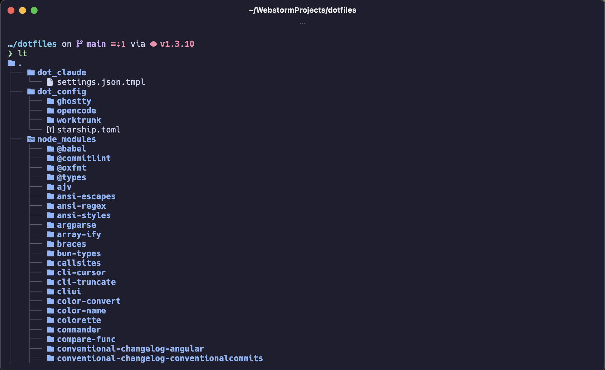
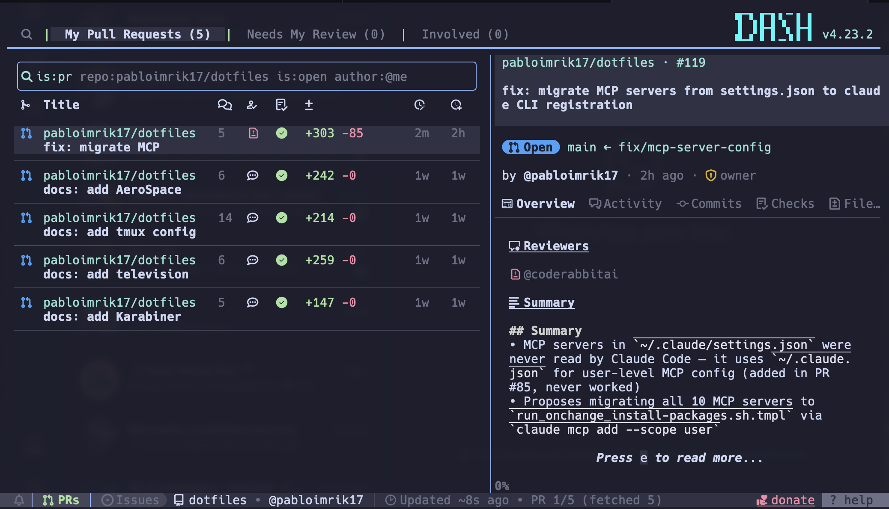
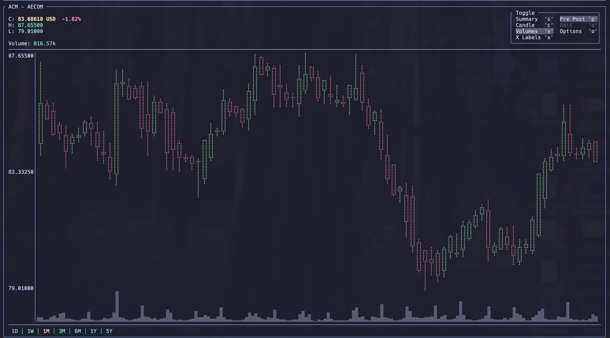

[](https://www.chezmoi.io/)
[](https://www.apple.com/macos/)
[](https://www.linux.org/)
[](https://www.zsh.org/)
[](https://catppuccin.com/)
[](https://starship.rs/)
[](https://ghostty.org/)

<p align="center">
  
</p>

<p align="center">
  
</p>

<p align="center">
  
</p>

chezmoi-managed dotfiles for macOS (primary) with Linux support. Built around Ghostty, Starship, zsh with Oh-My-Zsh, modern CLI replacements (`eza`, `bat`, `zoxide`, `fzf`), and AI tooling like Claude Code, OpenCode, and Agent of Empires. Everything themed with Catppuccin Mocha, with sensitive configs (like trading positions) encrypted at rest via `age`.

## What's Included

| Category       | Tool                                                                            | Description                                                                                |
| -------------- | ------------------------------------------------------------------------------- | ------------------------------------------------------------------------------------------ |
| **Terminal**   | [Ghostty](https://ghostty.org/)                                                 | GPU-accelerated terminal with Catppuccin Mocha theme                                       |
| **Terminal**   | [tmux](https://github.com/tmux/tmux)                                            | Terminal multiplexer for session management                                                |
| **Shell**      | [Zsh](https://www.zsh.org/) + [Oh-My-Zsh](https://ohmyz.sh/)                    | Shell framework with 27+ plugins (git, docker, fzf, nvm, bun…)                             |
| **Shell**      | [Starship](https://starship.rs/)                                                | Fast cross-shell prompt with Catppuccin palette                                            |
| **Shell**      | [zsh-autosuggestions](https://github.com/zsh-users/zsh-autosuggestions)         | Fish-like command suggestions                                                              |
| **Shell**      | [zsh-syntax-highlighting](https://github.com/zsh-users/zsh-syntax-highlighting) | Real-time syntax validation                                                                |
| **CLI Tools**  | [eza](https://eza.rocks/)                                                       | Modern `ls` with icons, colors, git integration                                            |
| **CLI Tools**  | [bat](https://github.com/sharkdp/bat)                                           | Modern `cat` with syntax highlighting                                                      |
| **CLI Tools**  | [zoxide](https://github.com/ajeetdsouza/zoxide)                                 | Smart `cd` that learns your directories                                                    |
| **CLI Tools**  | [fzf](https://github.com/junegunn/fzf)                                          | Fuzzy finder for files, history, and previews                                              |
| **CLI Tools**  | [fd](https://github.com/sharkdp/fd)                                             | Fast `find` alternative                                                                    |
| **CLI Tools**  | [ripgrep](https://github.com/BurntSushi/ripgrep)                                | Fast recursive grep                                                                        |
| **CLI Tools**  | [atuin](https://atuin.sh/)                                                      | Modern shell history search                                                                |
| **CLI Tools**  | [direnv](https://direnv.net/)                                                   | Auto-load/unload env vars per directory                                                    |
| **CLI Tools**  | [tickrs](https://github.com/tarkah/tickrs)                                      | Real-time stock ticker TUI with curated 42-symbol watchlist                                |
| **CLI Tools**  | [ticker](https://github.com/achannarasappa/ticker)                              | Terminal stock tracker with cost-basis positions and sector groups                         |
| **CLI Tools**  | [age](https://age-encryption.org/)                                              | Modern encryption tool backing the chezmoi-managed secrets workflow                        |
| **CLI Tools**  | [mole](https://github.com/tw93/mole)                                            | Deep clean and optimize your Mac — caches, logs, app remnants, `node_modules` (macOS only) |
| **Git**        | [git-delta](https://github.com/dandavison/delta)                                | Syntax-highlighted diff viewer                                                             |
| **Git**        | [lazygit](https://github.com/jesseduffield/lazygit)                             | TUI for git operations                                                                     |
| **Git**        | [GitHub CLI](https://cli.github.com/)                                           | GitHub from the terminal                                                                   |
| **Git**        | [gh-dash](https://github.com/dlvhdr/gh-dash)                                    | GitHub dashboard TUI with Catppuccin Mocha theme                                           |
| **Git**        | [gh-enhance](https://github.com/dlvhdr/gh-enhance)                              | GitHub Actions TUI for workflow runs                                                       |
| **Git**        | [Worktrunk](https://github.com/max-sixty/worktrunk)                             | Git worktree manager for parallel AI agent workflows                                       |
| **AI Tooling** | [Claude Code](https://code.claude.com/)                                         | AI coding assistant CLI with plugins                                                       |
| **AI Tooling** | [OpenCode](https://github.com/anomalyco/opencode)                               | AI code editor                                                                             |
| **AI Tooling** | [Agent of Empires](https://github.com/njbrake/agent-of-empires)                 | tmux-native TUI for managing parallel AI agent sessions (`aoe`)                            |
| **AI Tooling** | [CodeRabbit](https://www.coderabbit.ai/)                                        | AI code review CLI                                                                         |
| **Network**    | [Tailscale](https://tailscale.com/)                                             | Mesh VPN (WireGuard-based) for secure device-to-device networking                          |

## Setup

**Prerequisite:** [Homebrew](https://brew.sh/) installed.

1. Install [chezmoi](https://www.chezmoi.io/install/):

    ```sh
    brew install chezmoi
    ```

2. Bootstrap encryption (per machine, one-time):

    The repo carries encrypted secrets that `chezmoi apply` decrypts on the fly with [age](https://age-encryption.org/). Each machine needs your private key at `~/.config/chezmoi/key.txt`.

    **First machine ever:**

    ```sh
    brew install age
    mkdir -p ~/.config/chezmoi
    age-keygen -o ~/.config/chezmoi/key.txt
    chmod 600 ~/.config/chezmoi/key.txt
    ```

    Then save the file's full contents (public + private lines) to your password manager. The matching `recipient` is already committed in `.chezmoi.toml.tmpl`.

    **Every additional machine:**

    Restore `~/.config/chezmoi/key.txt` from your password manager (`chmod 600`).

    > ⚠️ Lose this file without a backup and the encrypted artifacts in the repo (e.g. `encrypted_dot_ticker.yaml.age`) become **irrecoverable**.

3. Initialize and apply:

    ```sh
    chezmoi init pabloimrik17/dotfiles
    chezmoi apply
    ```

    `chezmoi apply` triggers an interactive install script that sets up Homebrew packages, fonts, and CLI tools.

## Daily Workflows

### Pulling Latest Changes

**Quick** — pull and apply in one step:

```sh
chezmoi update
```

**Preview first** — review changes before applying:

```sh
chezmoi git pull -- --autostash --rebase
chezmoi diff
chezmoi apply
```

### Making & Pushing Changes

**Edit a source file directly:**

```sh
chezmoi edit ~/.zshrc
```

**Sync changes from a modified target file:**

```sh
# Non-template files
chezmoi re-add

# Template files (.tmpl) — re-add doesn't support templates
chezmoi add <file>
```

**Edit an encrypted file** (e.g. `~/.ticker.yaml`):

```sh
# Edit the plaintext on disk
$EDITOR ~/.ticker.yaml

# Re-encrypt the source-tree artifact
chezmoi re-add --encrypt ~/.ticker.yaml
```

**Commit and push:**

```sh
chezmoi git add .
chezmoi git -- commit -m "your message"
chezmoi git push
```
